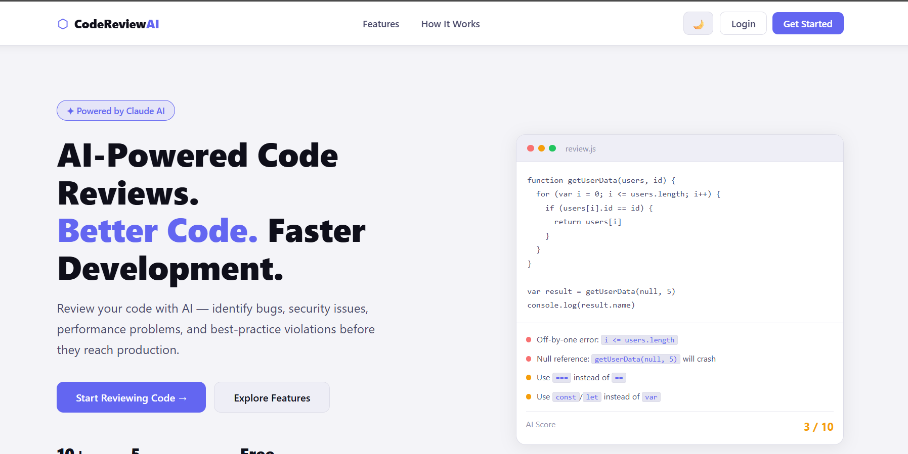
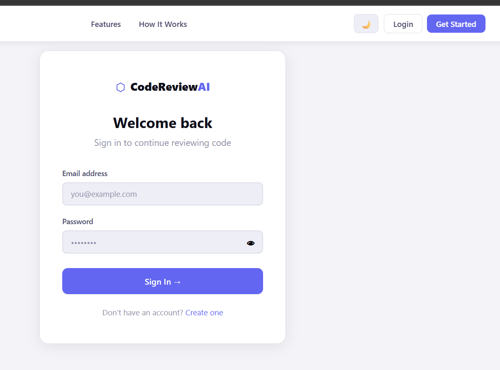
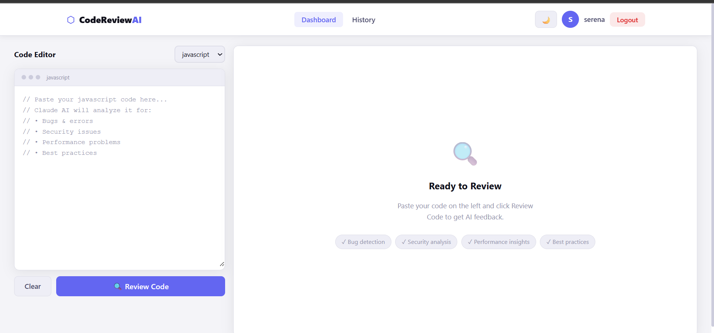
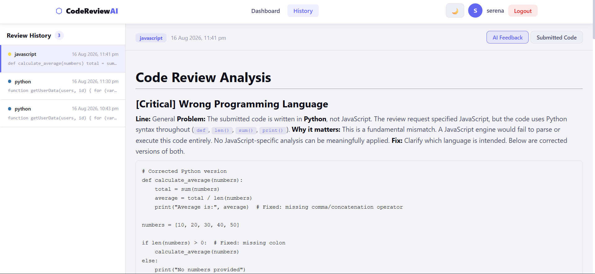

<div align="center">

# 🔍 CodeReviewAI

### AI-Powered Code Review Platform

**Detect bugs. Identify vulnerabilities. Improve code quality — instantly.**

[](LICENSE)

</div>

---

## 📸 Screenshots

### 🏠 Landing Page


### 🔐 Sign In Page


### 🖥️ Code Review Dashboard


### 📋 Review History


---

## 🚀 About the Project

**CodeReviewAI** is a full-stack MERN web application that integrates the **Claude AI API (Anthropic)** to perform deep, structured code reviews across 16+ programming languages. It provides severity-categorized findings — Critical, High, Medium, Low, and Good Practice — with detailed explanations, line-level references, and suggested fixes for each identified issue.

The project is built with React 19, Node.js, Express, and MongoDB, featuring secure JWT authentication, persistent review history, and a modern responsive dark/light theme system.

---

## ✨ Features & What's New in v2

| Feature | Description |
|---|---|
| 🤖 **Claude AI Reviews** | Powered by `claude-sonnet-4-6` for deep code analysis |
| 🏠 **Modern Landing Page** | Clean presentation with hero, features, languages, and how-it-works sections |
| 🔴🟠🟡🔵🟢 **Severity Classification** | Findings categorized as Critical / High / Medium / Low / Good |
| 🌙 **Dark & Light Mode** | Theme toggle with localStorage persistence via React Context API |
| 🔐 **JWT Authentication** | Secure login, register, password show/hide, and protected routes |
| 📋 **Review History** | All past reviews saved to MongoDB with a sidebar for quick toggling |
| 📊 **Structured Findings UI** | Split-panel layout separating code editor/view and detailed feedback |
| 📱 **Fully Responsive** | Optimized layouts for desktop, tablet, and mobile devices |
| 🔔 **Toast Notifications** | Modern in-app success/error toast alerts (no browser alerts) |
| 🖥️ **Code Editor Panel** | Monospace editor with language selector and clear/reset options |

---

## 🛠️ Tech Stack

**Frontend**
- React 19 + Vite
- React Router DOM v7
- React Markdown
- React Context API (Theme System)
- Vanilla CSS with CSS Variables

**Backend**
- Node.js + Express
- MongoDB Atlas + Mongoose
- JSON Web Tokens (JWT)
- bcryptjs

**AI Integration**
- Anthropic Claude API (`claude-sonnet-4-6` prompt patterns)
- Structured prompt engineering for severity-classified output

---

## 🏗️ Architecture

```
ai-code-review/
├── client/                        # React 19 + Vite frontend
│   └── src/
│       ├── context/
│       │   └── ThemeContext.jsx   # Global dark/light theme (React Context)
│       ├── components/
│       │   ├── Navbar.jsx         # Sticky nav — auth-aware, theme toggle
│       │   └── Toast.jsx          # Reusable toast notification system
│       ├── pages/
│       │   ├── Landing.jsx        # SaaS landing page
│       │   ├── Login.jsx          # Auth — show/hide password, toast errors
│       │   ├── Register.jsx       # Auth — validation, confirm password
│       │   ├── Dashboard.jsx      # Code editor + AI findings panel
│       │   └── History.jsx        # Past reviews with sidebar
│       └── api/
│           └── axios.js           # Axios instance with JWT interceptor
│
└── server/                        # Node.js + Express backend
    ├── routes/
    │   ├── auth.js                # POST /register, POST /login
    │   └── review.js              # POST /review, GET /review/history
    ├── models/
    │   ├── User.js                # MongoDB User schema
    │   └── Review.js              # MongoDB Review schema
    ├── middleware/
    │   └── protect.js             # JWT auth middleware
    └── index.js                   # Express server entry point
```

---

## ⚡ Getting Started

### Prerequisites

- Node.js v18+
- A [MongoDB Atlas](https://cloud.mongodb.com) database (or local MongoDB)
- An [Anthropic API Key](https://console.anthropic.com)

### 1. Clone the Repository

```bash
git clone https://github.com/yourusername/ai-code-review.git
cd ai-code-review
```

### 2. Set up the Backend

```bash
cd server
npm install
```

Create a `.env` file inside `/server`:

```env
MONGO_URI=your_mongodb_atlas_connection_string
JWT_SECRET=any_random_secret_string
ANTHROPIC_API_KEY=your_claude_api_key
```

Start the backend server:

```bash
node index.js
# ✅ MongoDB connected
# ✅ Server running on http://localhost:5000
```

### 3. Set up the Frontend

Open a new terminal window:

```bash
cd client
npm install
npm run dev
```

Open **http://localhost:5173** in your browser.

---

## 🔌 API Endpoints

| Method | Endpoint | Auth | Description |
|--------|----------|------|-------------|
| `POST` | `/api/auth/register` | ❌ | Create a new user account |
| `POST` | `/api/auth/login` | ❌ | Login and receive JWT token |
| `POST` | `/api/review` | ✅ JWT | Submit code for AI review |
| `GET` | `/api/review/history` | ✅ JWT | Fetch all reviews for logged-in user |

---

## 🧠 How the AI Review Works

1. User pastes code and selects language on the Dashboard.
2. Frontend calls `POST /api/review` with `{ code, language }`.
3. Backend sends a structured prompt to Claude Sonnet via Anthropic SDK.
4. Claude returns a structured markdown response with severity-classified headings.
5. Frontend parses the response into a findings list with severity badges.
6. Each finding displays: Problem → Why it matters → Fix → Corrected code block.

**Sample prompt structure sent to Claude:**
```
## [Critical] Issue Title
**Line:** 12
**Problem:** ...
**Why it matters:** ...
**Fix:** ...
```code
corrected code
```
```

---

## 🌐 Deployment

### Backend → Render

1. Push your code repository to GitHub.
2. Create a new **Web Service** on [render.com](https://render.com).
3. Set the Root Directory to `/server`.
4. Configure the environment variables (`MONGO_URI`, `JWT_SECRET`, `ANTHROPIC_API_KEY`).
5. Set Build Command to `npm install` and Start Command to `node index.js`.

### Frontend → Netlify / Vercel

1. Create a new site on your chosen platform.
2. Set the Root Directory to `/client`.
3. Set Build Command to `npm run build` and Publish Directory to `dist`.
4. Add environment variable: `VITE_API_URL=https://your-render-url.onrender.com/api`

---

## 🧪 Test the App

Paste this buggy JavaScript snippet into the editor to test the review system:

```javascript
function getUserData(users, id) {
  for (var i = 0; i <= users.length; i++) {
    if (users[i].id == id) {
      return users[i]
    }
  }
}

var result = getUserData(null, 5)
console.log(result.name)
```

**Expected findings:**
- 🔴 **Off-by-one error:** `i <= users.length` crashes on the last index.
- 🔴 **Null reference:** `null` is passed as the `users` array without checking.
- 🟠 **Unsafe property access:** No check before accessing `result.name`.
- 🟡 **Loose equality check:** `==` should be strict `===`.
- 🟡 **Scope declaration:** `var` should be `const`/`let`.

---

## 📄 License

This project is licensed under the MIT License. See [LICENSE](LICENSE) for details.

---

## 🙋‍♀️ Author

**Souparnika C**  
Senior Analyst & Full Stack Developer at Genpact

[](https://linkedin.com/in/yourprofile)
[](https://github.com/yourusername)

---

<div align="center">
  <sub>Built with ❤️ using React, Node.js, MongoDB, and Claude AI</sub>
</div>
