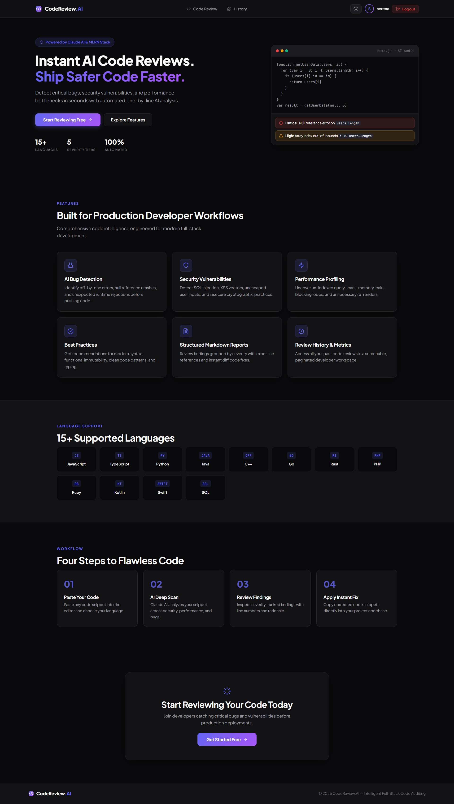
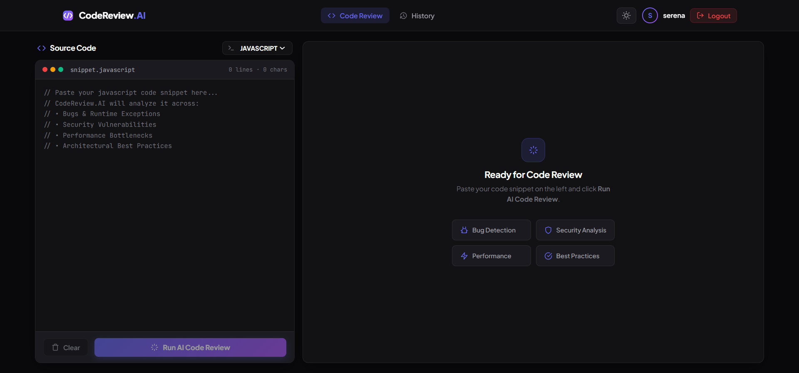
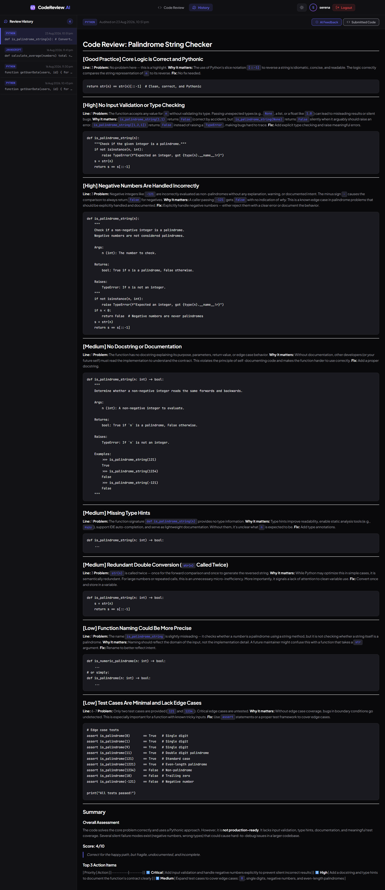

<div align="center">

# 🔍 CodeReviewAI

### AI-Powered Code Review Platform

**Detect bugs. Identify vulnerabilities. Improve code quality — instantly.**

[](https://aicodereviewtool-1.onrender.com)
[](LICENSE)

</div>

---

## 📸 Screenshots

### 🏠 Landing Page


### 🖥️ Code Review Dashboard


### 📋 Review History


---

## 🚀 About the Project

**CodeReviewAI** is a full-stack MERN application that integrates the **Anthropic Claude API** to perform deep, structured code reviews across 15+ programming languages. It returns severity-categorized findings — Critical, High, Medium, Low, and Good Practice — with detailed explanations, line-level references, and suggested fixes.

Production features include input validation, rate limiting, centralized error handling, structured logging, environment validation, automated unit & integration test suites, Docker containers, 1-click Render Blueprints, and SPA routing rewrites.

---

## ✨ Features

| Feature | Description |
|---|---|
| 🤖 **Claude AI Reviews** | Structured, severity-classified code analysis via the Anthropic SDK |
| 🔐 **JWT Authentication** | Registration/login with bcrypt hashing, rate-limited auth endpoints |
| 📋 **Review History** | Paginated history per user, backed by an indexed MongoDB query |
| 🌙 **Dark & Light Mode** | Theme toggle persisted via React Context + localStorage |
| 🔔 **Toast Notifications** | In-app success/error alerts |
| 🛡️ **Hardened API** | Helmet security headers, per-route rate limiting, request size caps, input validation |
| 🧯 **Centralized Error Handling** | Every route funnels errors through one handler — no leaked stack traces |
| ✅ **Automated Tests** | Jest + Supertest integration tests against an in-memory MongoDB |
| 🐳 **Dockerized & Render Ready** | Multi-stage client (nginx) and server images, plus `render.yaml` Blueprint stack |

---

## 🛠️ Tech Stack

**Frontend** — React 19 · Vite · React Router DOM v7 · React Markdown · Context API · Vanilla CSS + Custom SVG Icons

**Backend** — Node.js · Express · MongoDB (Mongoose) · JWT · bcryptjs · Helmet · express-rate-limit · express-validator · morgan

**AI Integration** — Anthropic Claude API (`claude-sonnet-5`)

**Tooling** — Jest · Supertest · mongodb-memory-server · Docker · Render Blueprints

---

## ⚡ Live Demo & Deployment

- **Live Web App**: [https://aicodereviewtool-1.onrender.com](https://aicodereviewtool-1.onrender.com)
- **Live API Backend**: [https://aicodereviewtool-fnls.onrender.com](https://aicodereviewtool-fnls.onrender.com)

---

## 🛠️ Getting Started

### Local Development

**Prerequisites:** Node.js v18+, MongoDB (local or Atlas), an [Anthropic API key](https://console.anthropic.com).

```bash
# Backend
cd server
npm install
cp .env.example .env   # fill in MONGO_URI, JWT_SECRET, ANTHROPIC_API_KEY
npm run dev             # http://localhost:5000

# Frontend (new terminal)
cd client
npm install
cp .env.example .env    # VITE_API_URL defaults to http://localhost:5000/api
npm run dev              # http://localhost:5173
```

### Running the Test Suite

```bash
cd server
npm test
```

---

## 🔌 API Endpoints

| Method | Endpoint | Auth | Rate-limited | Description |
|--------|----------|------|--------------|--------------|
| `POST` | `/api/auth/register` | ❌ | ✅ | Create a new user account |
| `POST` | `/api/auth/login` | ❌ | ✅ | Login and receive a JWT |
| `POST` | `/api/review` | ✅ JWT | ✅ (strict) | Submit code for AI review |
| `GET` | `/api/review/history?page=&limit=` | ✅ JWT | ✅ | Paginated review history for the logged-in user |
| `GET` | `/health` | ❌ | — | Liveness/readiness check, reports DB connection state |

---

## 📄 License

MIT — see [LICENSE](LICENSE).

---

## 🙋‍♀️ Author

**Souparnika C** — Full Stack Developer

[](https://github.com/so123789)

---

<div align="center">
  <sub>Built with React, Node.js, MongoDB, and the Anthropic Claude API</sub>
</div>
